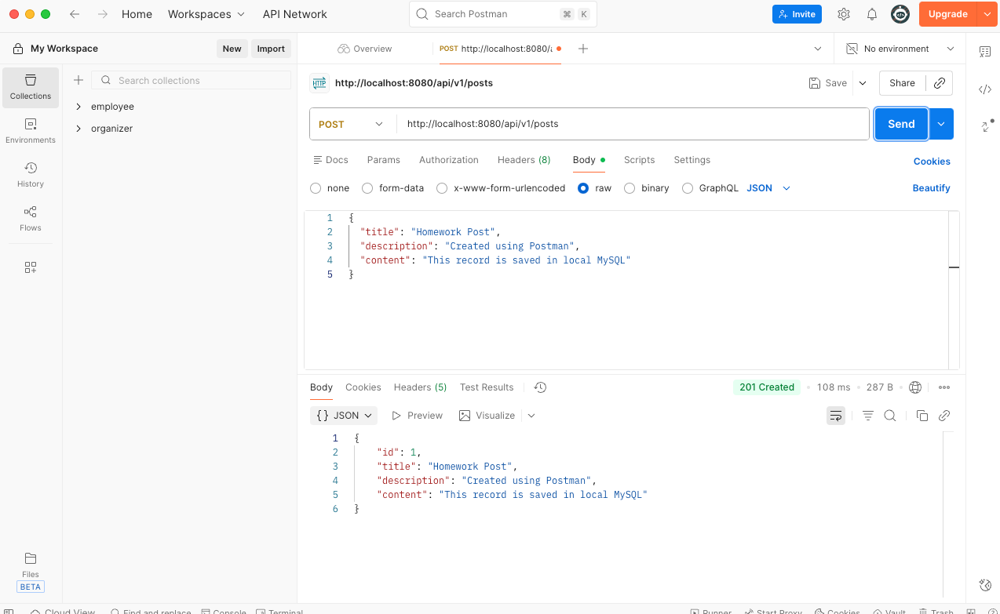
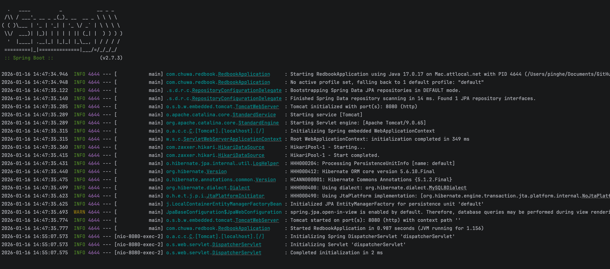

  

1.
The table is not created at the beginning.
After Modifying the "spring.jpa.hibernate.ddl-auto=update" in application.properties. the table is created successfully.
This tells Spring: “If tables don’t exist, create them.”
The @Entity class exist. Hibernate auto-create tables.

2.
the id stored in the database is not supposed to be the same as an id you put in your POST request.
This happens because your entity’s id is almost certainly annotated to be auto-generated by the database/Hibernate:

@Entity
@Table(
        name = "posts",
        uniqueConstraints = {
             @UniqueConstraint(columnNames = {"title"})
        }
)
public class Post {

    @Id
    @GeneratedValue(strategy = GenerationType.IDENTITY)
    private Long id;